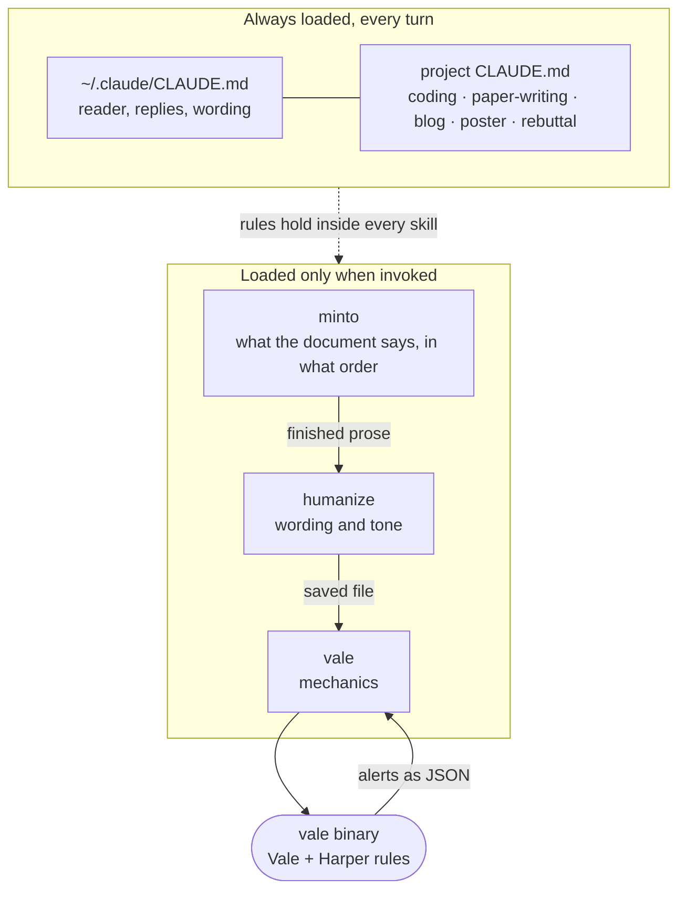

# Open Claude Skills

A collection of reusable [Claude Code](https://claude.com/claude-code) skills and `CLAUDE.md` templates, aimed at academic writing and research workflows.

This repository is a curated public mirror — a private working repo holds the full set, and only the entries that are self-contained and useful outside my own machine get published here.

## Skills

| Skill | What it does |
|---|---|
| `academic-graphic-design` | Style guide for publication-quality figures and tables: color palettes, typography, layout, inline annotations. |
| `backup` | Snapshots a LaTeX manuscript into `fallback/<tag>/` with an auto-incremented version tag and a manifest row, before any significant edit. |
| `detect-prompt-injection` | Scans PDFs for hidden prompt-injection text (zero-width glyphs, `ActualText` entries) before an LLM reads them. Bundles its own scanners. |
| `email` | Writes or revises an email so that it gets a reply, against budgets measured on real mailboxes in five peer-reviewed studies: a 40 to 50 word body, one person on the To line, one answerable question, a short subject, no manual line breaks, no font settings. Covers cold outreach and CAN-SPAM. |
| `en-zh-translation` | Practices for English → Simplified Chinese prose translation: terminology consistency, sentence restructuring, punctuation, bilingual LaTeX typesetting. |
| `humanize` | Makes Claude-written prose read as human, with per-1,000-word budgets for the tics that actually show up under measurement (`rather than`, negation frames, em dashes, bold and table scaffolding) and rewrites for each. |
| `latex-paper-project` | File layout and editing conventions for LaTeX paper projects (`main.tex`, `sections/`, `figures/`, `tables/`, `zotero.bib`). |
| `minto` | Structures a document as a Minto pyramid before drafting, or reverse-engineers a draft into one and repairs it. Covers memos, Slack messages, reports, and proposals as well as papers and rebuttals. |
| `modern-cli` | Prefers faster CLI replacements (eza, bat, fd, rg, dust, tokei, xh) with flags that suppress interactive TUI output. |
| `paper-summary` | Turns paper PDFs into structured two-section deep dives: executive summary plus method walkthrough. |
| `system-branding` | Generates names for CS research systems, then checks uniqueness against Google Scholar, GitHub, and DBLP. |
| `vale` | Runs the Vale prose linter as a deterministic editing pass: applies the fix each rule defines, lists what needs judgment, and names the error classes a pattern linter cannot see. Ships a tuned config for Markdown and LaTeX. |

## `CLAUDE.md` templates

Drop-in project instructions for a given kind of work: `blog`, `coding`, `paper-writing`, `poster`, `rebuttal`.

## Slash commands

Single-file prompts under `commands/`; `commands/<name>.md` becomes `/<name>` once it is in a project's `.claude/commands/`. They are never auto-triggered.

| Command | What it does |
|---|---|
| `cwd` | `/cwd <folder>` sets, or creates, the working folder for the current task inside the repository. Type `@` to autocomplete an existing folder name. |
| `ship` | `/ship [why]` stages every change in the current repository, commits it with a message that explains why (the diff already shows what), and pushes. It refuses to add files that look like secrets or exceed 10 MB, runs a pre-commit step only if the repository documents one, and never force-pushes. |

## Installation

Copy the directories you want into your project:

```bash
mkdir -p .claude/skills .claude/commands
cp -r skills/modern-cli .claude/skills/
cp commands/cwd.md commands/ship.md .claude/commands/
cp claudemd/paper-writing/CLAUDE.md ./CLAUDE.md
```

Skills also work from `~/.claude/skills/` if you want them available in every project.

## How skills work

A skill is a directory containing a `SKILL.md` — YAML frontmatter plus a markdown body:

```markdown
---
name: my-skill
description: Short summary used for auto-matching, roughly 250 characters.
---

# My Skill

Instructions, conventions, and examples.
```

Claude Code loads every installed skill's **description** into context, but only pulls in the body when the skill is actually invoked — either explicitly with `/my-skill`, or automatically when Claude judges the description relevant to your request. The explicit form is the reliable one.

See the [skills documentation](https://docs.claude.com/en/docs/claude-code/skills) for the full specification.

## Skills vs. `CLAUDE.md`

|  | Skills | `CLAUDE.md` |
|---|---|---|
| **Loaded** | Description always, body on demand | In full, every conversation |
| **Best for** | Reusable recipes, optional conventions | Mandatory rules you never want skipped |
| **Invoked** | `/skill-name`, or auto-matched | Automatic |

Rule of thumb: if you would be annoyed when Claude forgets a rule, it belongs in `CLAUDE.md`. If it is a recipe you reach for occasionally, make it a skill.

## How the pieces fit together



The two boxes are different kinds of thing. The top one is rules, read on every
turn whether or not you ask for them. The bottom one is procedures: only each
skill's `description` sits in context, and the body arrives when the skill is
called.

The writing chain runs down the bottom box. `minto` settles the structure and
hands the prose to `humanize`; `humanize` settles the wording and, as its last
step, hands the saved file to `vale`; `vale` shells out to the linter and reads
the alerts back as JSON. Each stage calls the next one only, so the linter runs
once per draft, which matters because it re-raises alerts you deliberately left.

## How `CLAUDE.md` layers

Claude Code loads every `CLAUDE.md` it can find, in full, at the start of each session: `~/.claude/CLAUDE.md` first, then each `CLAUDE.md` from the working directory up to `/`. The files concatenate; a lower file never overrides a higher one, and a rule that appears twice is read twice. The presets here are meant for two layers:

| Layer | Source | Copy to | Loaded when | Holds |
|---|---|---|---|---|
| User | `claudemd/global/CLAUDE.md` | `~/.claude/CLAUDE.md` | every session, in every directory | who the reader is, how replies and prose are written |
| Project | `claudemd/<mode>/CLAUDE.md` | `<project>/CLAUDE.md` | sessions started inside that project | rules for one kind of work: `coding`, `paper-writing`, `blog`, `poster`, `rebuttal` |

Skills are the third layer: their descriptions are always loaded, their bodies only on `/name` or auto-match.

- A rule lives in the highest layer where it is always true. Reply style and a notes naming convention are user-level; LaTeX float placement is project-level; a figure palette is a skill.
- Do not put a `CLAUDE.md` in `$HOME` itself. It is a parent of every project, so it loads everywhere, and it is easy to forget it exists.
- Do not repeat a rule across layers. Duplicates cost tokens every turn and drift into contradictions.

## License

MIT
